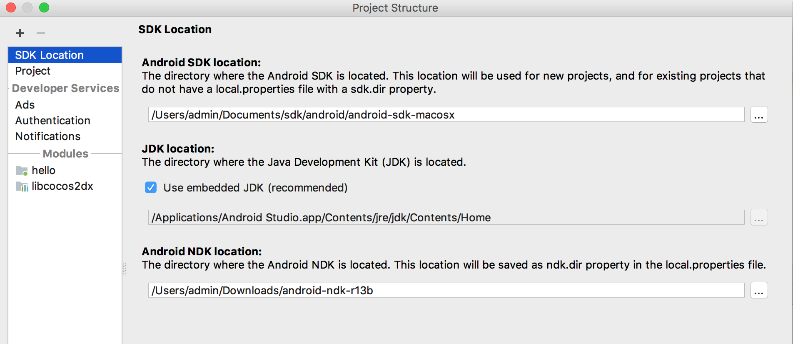

# Cocos2d-x 2.2.6 support Android Studio IDE and cocos command

Tested with 3.8.1 console command, Android Studio 3.2.1.

## setup

1. copy `hello` folder to `cocos2d-x-2.2.6/project/`
2. copy `libcocos2dx` folder to `cocos2d-x-2.2.6/cocos2dx/platform/android`


## run with cocos command

cocos command version < 3.17
```
cocos run -p android --android-studio
```


# Debug C++

1.  NDK >= android-ndk-r13b

2.  Set Project's NDK

    

3.  Android.mk

    ```makefile
    # !!!! dangerous, ONLY for debuging c++ with Android Studio
    ifeq ($(NDK_DEBUG),1)
      LOCAL_ALLOW_UNDEFINED_SYMBOLS := true
    endif
    # !!!! dangerous!!!!
    ```

<p>Support update 3rd libs via PayPal:
<br>  <a href="https://www.paypal.com/cgi-bin/webscr?cmd=_s-xclick&amp;hosted_button_id=P7H86JDPVCA3E" rel="nofollow"></a> $100, $500, $1000, others.</p>

ref to https://github.com/c0i/cocos2d-x-v2
